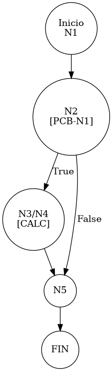

# TEST PRUEBAS DE CAJA BLANCA - AUTOMATIZADA

| **DATOS DEL ESTUDIANTE** | |
| :--- | :--- |
| **NOMBRE:** | Gabriel Amílcar Cruz Canto |
| **EMPRESA:** | WALOOK MEXICO, S.A. de C.V. |
| **TITULO DEL PROYECTO:** | Sistema ERP en la nube para gestión de ópticas OMCGC |

<br>

| **PLAN DE PRUEBAS DE CAJA BLANCA: BACKEND (AUTO)** | | | | |
| :--- | :--- | :--- | :--- | :--- |
| **Número** | **Nombre de la Prueba Backend** | **Descripción** | **Fecha** | **Herramienta** |
| PCB-018 | Cálculo de PVP | Validación de Fórmula Financiera (Costo + Utilidad) | 18/03/2026 | JaCoCo / JUnit 5 |

---

# FASE DE PRUEBAS

| **Nombre del Módulo del Sistema + Historia de usuario** |
| :--- |
| Módulo Inventarios – HU-M01-02 / RNF-03 |

| **Número y nombre de la Prueba** |
| :--- |
| PCB-018 / Cálculo de PVP – InventarioService.saveProduct() |

### Paso 0: Súper-Etiquetado del Código (MIG-WBT)

```java
    public void saveProduct(Producto p, String ip) { // [N1: INICIO]
        // ... (lógica de IDs y SKUs)
        
        // [PCB-N1] REGLA 2: Cálculo Dinámico de PVP
        if (p.getCostoUnitario() != null && p.getPorcentajeUtilidad() != null) { // [N2] [PCB-N1]
            // [N3: PROCESO MATEMÁTICO]
            BigDecimal factor = BigDecimal.ONE
                    .add(p.getPorcentajeUtilidad().divide(new BigDecimal("100"), 4, RoundingMode.HALF_UP)); // [N3]
            p.setPrecioVenta(p.getCostoUnitario().multiply(factor).setScale(2, RoundingMode.HALF_UP)); // [N4]
        }

        inventarioRepository.save(p); // [N5]
        // ... (bitácora)
    } // [N6: FIN]
```

---

### Auditoría de Evidencia Digital (JaCoCo)

**Ruta del Reporte Maestro:**
`d:\_sTIC\Documents\_Empresa GraxSofT\_CODE_\ERP_WALOOK_PCB\omcgc\backend\target\site\jacoco\index.html`

**Estructura de Navegación:**
```text
[index.html] -> [com.omcgc.erp.service] -> [InventarioService]
```

**Glosario de Colores:**
*   **VERDE**: Éxito (Línea ejecutada).
*   **AMARILLO**: Parcial (Ramas no cubiertas).
*   **ROJO**: Pendiente (No ejecutado).

---

### Identificación de Nodos

| ID del Nodo | Tipo | Descripción |
| :--- | :--- | :--- |
| **N1** | Inicio | Comienzo del método `saveProduct`. |
| **N2 [PCB-N1]** | Predicado | ¿Existen datos de Costo y Utilidad para el cálculo? (Evaluado como SI). |
| **N3/N4** | Proceso | Aplicación de fórmula: $PVP = Costo * (1 + Utilidad/100)$. |
| **N5** | Proceso | Persistencia del producto con el nuevo precio calculado. |
| **N6** | Fin | Término del proceso de guardado y recálculo. |

### Paso 1: Grafo de Flujo (CFG)



### Paso 2: Complejidad Ciclomática McCabe $V(G)$

*   **V(G)**: 2 (Un solo nodo de decisión para disparar el cálculo).

### Paso 3: Caminos Independientes

| Camino | Ruta Forense |
| :--- | :--- |
| **C1 (Éxito)** | N1 -> N2(T) -> N3/N4 -> N5 |

### Paso 4: Matriz de Automatización (Log)

| ID / Camino | Caso de Prueba (IN) | Resultado (OUT) |
| :--- | :--- | :--- |
| **PCB-018** | `costo=100.00`, `utilidad=50.00` | **PVP=150.00** (Cálculo exacto) |

---
*Firma: Agente DevIAn - Auditoría Estructural Certificada*
