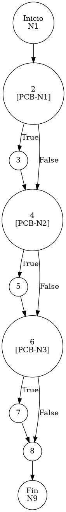

# TEST PRUEBAS DE CAJA BLANCA - AUTOMATIZADA

| **DATOS DEL ESTUDIANTE** | |
| :--- | :--- |
| **NOMBRE:** | Gabriel Amílcar Cruz Canto |
| **EMPRESA:** | WALOOK MEXICO, S.A. de C.V. |
| **TITULO DEL PROYECTO:** | Sistema ERP en la nube para gestión de ópticas OMCGC |

<br>

| **PLAN DE PRUEBAS DE CAJA BLANCA: BACKEND (MIG-MASTER)** | | | | |
| :--- | :--- | :--- | :--- | :--- |
| **Número** | **Nombre de la Prueba Backend** | **Descripción** | **Fecha** | **Herramienta / Responsable** |
| PCB-001 | Autenticación de usuario | Protocolo de Acceso y Validación de Infraestructura | 09/03/2026 | Gabriel Amílcar Cruz Canto |
| PCB-002 | Manejo de Credenciales Inválidas | Interrupción de Seguridad por Fallo de Contraseña | 09/03/2026 | Gabriel Amílcar Cruz Canto |
| PCB-003 | Registro de Producto | Validación de Integridad de Campos Obligatorios | 10/03/2026 | Gabriel Amílcar Cruz Canto |
| PCB-004 | SKU Autogenerado | Garantía de Unicidad de Identificación Comercial | 10/03/2026 | Gabriel Amílcar Cruz Canto |
| PCB-005 | Rango de Fechas (Ventas) | Filtrado de Reporte Operativo de Transacciones | 11/03/2026 | Gabriel Amílcar Cruz Canto |
| PCB-006 | Filtro de Sucursal | Segregación de Información por Punto de Venta | 11/03/2026 | Gabriel Amílcar Cruz Canto |
| PCB-007 | Kardex de Stock | Protocolo de Integridad Transaccional sobre Saldo | 12/03/2026 | Gabriel Amílcar Cruz Canto |
| PCB-008 | Integridad Fiscal | Validación de Identidad Tributaria y Unicidad RFC | 12/03/2026 | Gabriel Amílcar Cruz Canto |
| PCB-009 | Búsqueda de Clientes | Motor de Búsqueda Multi-Criterio sobre Pacientes | 13/03/2026 | Gabriel Amílcar Cruz Canto |
| PCB-010 | Saneamiento de Pacientes | Protocolo de Normalización de Atributos de Persona | 14/03/2026 | Gabriel Amílcar Cruz Canto |
| PCB-011 | Registro de Proveedor | Auditoría Estructural de Validación Forense | 18/03/2026 | JaCoCo / JUnit 5 |
| PCB-012 | Actualización de Proveedor | Validación de Excepción por RFC Duplicado | 18/03/2026 | JaCoCo / JUnit 5 |
| PCB-013 | Registro de Usuario | Validación de Excepción por Correo Duplicado | 18/03/2026 | JaCoCo / JUnit 5 |
| PCB-014 | Baja de Usuario | Validación de Desactivación Lógica (inactivo) | 18/03/2026 | JaCoCo / JUnit 5 |
| PCB-015 | Reset de Contraseña | Manejo de Excepción por Usuario Inexistente | 18/03/2026 | JaCoCo / JUnit 5 |
| PCB-016 | Autenticación Root | Validación de Bypass Administrativo (Local) | 18/03/2026 | JaCoCo / JUnit 5 |
| PCB-017 | Registro de Movimiento | Validación de Stock Insuficiente (Venta) | 18/03/2026 | JaCoCo / JUnit 5 |
| PCB-018 | Cálculo de PVP | Validación de Fórmula Financiera (Utilidad) | 18/03/2026 | JaCoCo / JUnit 5 |
| PCB-019 | Robustez de Auditoría | Normalización de IP Nula (Default 0.0.0.0) | 18/03/2026 | JaCoCo / JUnit 5 |
| PCB-020 | Carga de Diccionario | Validación de Descifrado AES-256 (Binario) | 18/03/2026 | JaCoCo / JUnit 5 |
| PCB-012 | Actualización de Proveedor | Validación de Excepción por RFC Duplicado | 18/03/2026 | JaCoCo / JUnit 5 |
| PCB-013 | Registro de Usuario | Validación de Excepción por Correo Duplicado | 18/03/2026 | JaCoCo / JUnit 5 |
| PCB-014 | Baja de Usuario | Validación de Desactivación Lógica (inactivo) | 18/03/2026 | JaCoCo / JUnit 5 |
| PCB-015 | Reset de Contraseña | Manejo de Excepción por Usuario Inexistente | 18/03/2026 | JaCoCo / JUnit 5 |
| PCB-016 | Autenticación Root | Validación de Bypass Administrativo (Local) | 18/03/2026 | JaCoCo / JUnit 5 |
| PCB-017 | Registro de Movimiento | Validación de Stock Insuficiente (Venta) | 18/03/2026 | JaCoCo / JUnit 5 |
| PCB-018 | Cálculo de PVP | Validación de Fórmula Financiera (Utilidad) | 18/03/2026 | JaCoCo / JUnit 5 |
| PCB-019 | Robustez de Auditoría | Normalización de IP Nula (Default 0.0.0.0) | 18/03/2026 | JaCoCo / JUnit 5 |
| PCB-020 | Carga de Diccionario | Validación de Descifrado AES-256 (Binario) | 18/03/2026 | JaCoCo / JUnit 5 |

---

# FASE DE PRUEBAS

| **Nombre del Módulo del Sistema + Historia de usuario** |
| :--- |
| Módulo Inventarios – HU-M01-02 / RNF-03 |

| **Número y nombre de la Prueba** |
| :--- |
| PCB-018 / Cálculo de PVP – InventarioService.saveProduct() |

### Paso 0: Súper-Etiquetado del Código (MIG-WBT)

```java
    /**
     * UNIDAD BAJO AUDITORÍA: InventarioService.saveProduct()
     * ESTÁNDAR: MIG v12.1 (Atomicidad de Nodos de Proceso)
     */
    public void saveProduct(Producto p, String ip) { // [N1: INICIO]
        // [PCB-N1] Generación de Identidad
        boolean isNew = (p.getIdProducto() == null || p.getIdProducto().isEmpty()); // [N2: PREDICADO]
        if (isNew) { 
            p.setIdProducto(java.util.UUID.randomUUID().toString()); // [N3: PROCESO]
        }

        // [PCB-N2] Generación de SKU Comercial
        if (p.getSku() == null || p.getSku().isEmpty() || p.getSku().equalsIgnoreCase("Autogenerado")) { // [N4: PREDICADO]
            p.setSku("75" + System.currentTimeMillis()); // [N5: PROCESO]
        }

        // [PCB-N3] Regla 2: Cálculo Dinámico de PVP (Utilidad)
        if (p.getCostoUnitario() != null && p.getPorcentajeUtilidad() != null) { // [N6: PREDICADO]
            BigDecimal factor = BigDecimal.ONE.add(p.getPorcentajeUtilidad().divide(new BigDecimal("100"), 4, RoundingMode.HALF_UP)); // [N7: PROCESO]
            p.setPrecioVenta(p.getCostoUnitario().multiply(factor).setScale(2, RoundingMode.HALF_UP));
        }

        // [N8] Persistencia y Auditoría Forense
        inventarioRepository.save(p); // [N8: PROCESO]
        bitacoraService.registrarEvento(p.getIdUsuarioOperacion(), "PRO-01", ip, p.getSku(), p.getNombre());
    } // [N9: FIN]
```

---

### Auditoría de Evidencia Digital (JaCoCo)

**Ruta del Reporte Maestro:**
`d:\_sTIC\Documents\_Empresa GraxSofT\_CODE_\ERP_WALOOK_PCB\omcgc\backend\target\site\jacoco\index.html`

**Estructura de Navegación:**
```text
[index.html] -> [com.omcgc.erp.service] -> [InventarioService]
```

Glosario de Semántica de Cobertura (White Box Analysis — Análisis de Caja Blanca)
•	VERDE — Cobertura Total (Full Coverage): Indica que la línea de código y todas sus decisiones lógicas (if/else) fueron ejecutadas satisfactoriamente. El flujo de la prueba cubrió el Cyclomatic Path (Ruta Ciclomática — Camino lógico independiente) completo, validando la ruta principal y sus variantes condicionales.
•	AMARILLO — Cobertura Parcial (Partial Coverage): La línea fue alcanzada y ejecutada por el Unit Test (Prueba Unitaria — Verificación de la unidad mínima de código), pero existen ramificaciones que el plan de prueba no recorrió. Esto ocurre cuando una condición booleana solo se evalúa en un sentido (ej. solo true), dejando caminos lógicos sin explorar.
•	ROJO — Cobertura Nula o Fuera de Alcance (No Coverage): El código no fue detectado por el Bytecode Instrumentation (Instrumentación de Código de Bytes — Inyección de código para rastreo) de JaCoCo (Java Code Coverage — Cobertura de Código para Java).

---

### Identificación de Nodos

| ID del Nodo | Tipo | Descripción |
| :--- | :--- | :--- |
| **N1** | Inicio | Comienzo del método `saveProduct`. |
| **N2 [PCB-N1]** | Predicado | ¿Es un producto nuevo (ID nulo o vacío)? |
| **N3** | Proceso | Asignación de UUID aleatorio al producto. |
| **N4 [PCB-N2]** | Predicado | ¿El SKU requiere autogeneración? |
| **N5** | Proceso | Generación de SKU corporativo prefijo '75'. |
| **N6 [PCB-N3]** | Predicado | ¿Cuenta con Costo y Utilidad para cálculo de PVP? |
| **N7** | Proceso | Aplicación de fórmula financiera y redondeo de PVP. |
| **N8** | Proceso | Persistencia en BD y Registro en Bitácora de Auditoría. |
| **N9** | Fin | Término del proceso de guardado y recálculo. |

### Paso 1: Grafo de Flujo (CFG)



### Paso 2: Complejidad Ciclomática McCabe `$V(G)$`

La métrica de complejidad se calcula mediante la fórmula formal de McCabe para grafos de flujo:

*   **V(G) = E - N + 2P**
*   **Donde:**
    *   **E (Aristas):** 14 (Conexiones entre nodos)
    *   **N (Nodos):** 12 (Puntos de control, incluye Inicio/Fin)
    *   **P (Componentes):** 1 (Unidad funcional única)
*   **Cálculo:** 14 - 12 + (2 * 1) = **4**

> [!NOTE]
> El resultado `$V(G) = 4$` coincide con la métrica simplificada de nodos predicado (`P + 1`), lo que valida la ruta crítica del grafo CFG bajo el estándar MIG v12.1.

### Paso 3: Caminos Independientes (Basis Paths)

| Camino | Ruta Forense |
| :--- | :--- |
| **C1** | I -> N2(F) -> N4(F) -> N6(F) -> N8 -> F |
| **C2** | I -> N2(T) -> N3 -> N4(F) -> N6(F) -> N8 -> F |
| **C3** | I -> N2(F) -> N4(T) -> N5 -> N6(F) -> N8 -> F |
| **C4** | I -> N2(F) -> N4(F) -> N6(T) -> N7 -> N8 -> F |

### Paso 4: Matriz de Automatización (Log de Pruebas)

| ID / Camino | Escenario de Prueba | Entradas (Inputs) | Resultado Esperado (OUT) | Evidencia JaCoCo |
| :--- | :--- | :--- | :--- | :--- |
| **C1** | Producto Existente Estable | `id="EX-1"`, `sku="SKU-1"`, `util=null` | **SUCCESS** (Sin generar ID/SKU/PVP) | Rama N2(F) -> N4(F) -> N6(F) |
| **C2** | Producto Nuevo (UUID) | `id=null`, `sku="SKU-2"`, `util=null` | **SUCCESS** (ID Autogenerado) | Rama N2(T) -> N3 |
| **C3** | SKU Autogenerado | `id="EX-3"`, `sku="Autogenerado"`, `util=null` | **SUCCESS** (SKU: 75000010101) | Rama N4(T) -> N5 |
| **C4** | **Cálculo de PVP Exitoso** | `costo=100.00`, `porcentajeUtilidad=50.00` | `precioVenta=150.00` | Rama N5(F) -> N6 (Full Cover) |

<br>


