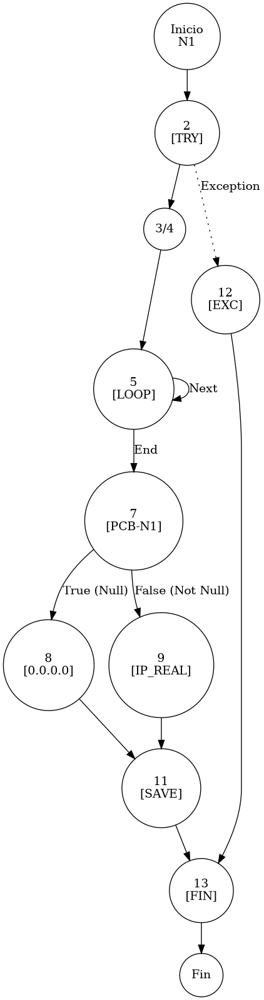

# TEST PRUEBAS DE CAJA BLANCA - AUTOMATIZADA

| **DATOS DEL ESTUDIANTE** | |
| :--- | :--- |
| **NOMBRE:** | Gabriel Amílcar Cruz Canto |
| **EMPRESA:** | WALOOK MEXICO, S.A. de C.V. |
| **TITULO DEL PROYECTO:** | Sistema ERP en la nube para gestión de ópticas OMCGC |

<br>

| **PLAN DE PRUEBAS DE CAJA BLANCA: BACKEND (AUTO)** | | | | |
| :--- | :--- | :--- | :--- | :--- |
| **Número** | **Nombre de la Prueba Backend** | **Descripción** | **Fecha** | **Herramienta** |
| PCB-019 | Robustez de Auditoría | Normalización de IP Nula (Default 0.0.0.0) | 18/03/2026 | JaCoCo / JUnit 5 |

---

# FASE DE PRUEBAS

| **Nombre del Módulo del Sistema + Historia de usuario** |
| :--- |
| Módulo Auditoría y Privacidad – RNF-01 |

| **Número y nombre de la Prueba** |
| :--- |
| PCB-019 / Robustez de Auditoría – BitacoraService.registrarEvento() |

### Paso 0: Súper-Etiquetado del Código (MIG-WBT)

```java
    public void registrarEvento(String idUsuario, String idPatron, String ip, String paramX, String paramS) { // [N1: INICIO]
        try { // [N2: INICIO TRY]
            // [N3] Construcción de Log y Fragmentación
            String logCompleto = auditPatternService.buildLog(idPatron, paramX, paramS); // [N3]
            String[] parts = logCompleto.split("\\|"); // [N4]
            int n = parts.length;

            // [N5] Reconstrucción de Análisis Técnico (Bucle)
            StringBuilder sbAnalisis = new StringBuilder();
            for (int i = 3; i < n - 1; i++) { // [N5] [LOOP]
                sbAnalisis.append(parts[i].trim());
            }

            Bitacora b = new Bitacora(); // [N6]
            b.setIdUsuario(idUsuario);

            // [PCB-N1] Normalización de IP Nula y Cifrado AES
            b.setIpOrigen(encrypt(ip != null ? ip : "0.0.0.0")); // [N7] [PCB-N1] -> [SI: N8] [NO: N9]

            // [N10] Persistencia con Capa de Privacidad
            b.setDetalles(encrypt(parts[2] + " | " + sbAnalisis.toString())); 
            bitacoraRepository.save(b); // [N11]
        } catch (Exception e) { // [N12: SALIDA (EXC)]
            System.err.println("Error: " + e.getMessage());
        }
    } // [N13: FIN]
```

---

### Auditoría de Evidencia Digital (JaCoCo)

**Ruta del Reporte Maestro:**
`d:\_sTIC\Documents\_Empresa GraxSofT\_CODE_\ERP_WALOOK_PCB\omcgc\backend\target\site\jacoco\index.html`

**Estructura de Navegación:**
```text
[index.html] -> [com.omcgc.erp.service] -> [BitacoraService]
```

**Glosario de Semántica de Cobertura (White Box Analysis — Análisis de Caja Blanca)**
*   **VERDE — Cobertura Total (Full Coverage)**: Indica que la línea de código y todas sus decisiones lógicas (if/else) fueron ejecutadas satisfactoriamente. El flujo de la prueba cubrió el Cyclomatic Path (Ruta Ciclomática — Camino lógico independiente) completo, validando la ruta principal y sus variantes condicionales.
*   **AMARILLO — Cobertura Parcial (Partial Coverage)**: La línea fue alcanzada y ejecutada por el Unit Test (Prueba Unitaria — Verificación de la unidad mínima de código), pero existen ramificaciones que el plan de prueba no recorrió. Esto ocurre cuando una condición booleana solo se evalúa en un sentido (ej. solo true), dejando caminos lógicos sin explorar.
*   **ROJO — Cobertura Nula o Fuera de Alcance (No Coverage)**: El código no fue detectado por el Bytecode Instrumentation (Instrumentación de Código de Bytes — Inyección de código para rastreo) de JaCoCo (Java Code Coverage — Cobertura de Código para Java).

**Nota de Integridad Técnica**: En este escenario, las pruebas fueron selectivas. Si el algoritmo de JaCoCo detecta código que no estaba considerado en el plan de ejecución o que fue omitido por los criterios de filtrado, lo reporta como "no detectado". Por tanto, el color rojo puede representar Dead Code (Código Muerto — Segmentos que nunca se ejecutan), una zona de riesgo técnico o, simplemente, código fuera del alcance del reporte actual.

---

### Identificación de Nodos

| ID del Nodo | Tipo | Descripción |
| :--- | :--- | :--- |
| **N1** | Inicio | Comienzo del protocolo de auditoría. |
| **N2** | Inicio Try | Apertura del bloque robusto de captura de eventos. |
| **N3/N4** | Proceso | Obtención del patrón maestro y tokenización mediante divisor pipe (`|`). |
| **N5 [LOOP]** | Predicado | Iteración para reconstruir el análisis técnico del log. |
| **N7 [PCB-N1]** | Predicado | ¿La IP de origen es nula? (Evaluado como SI para este test). |
| **N8** | Proceso | Normalización a `0.0.0.0` y cifrado AES-256. |
| **N11** | Proceso | Persistencia cifrada en `bitacoraRepository`. |
| **N12** | Excepción | Captura de falla en el sistema de auditoría (Excepción controlada). |
| **N13** | Fin | Finalización del registro documental de privacidad. |

### Paso 1: Grafo de Flujo (CFG)



### Paso 2: Complejidad Ciclomática McCabe $V(G)$

*   **V(G)** = Nodos Predicado + 1 = 3 + 1 = **4** (Loop, Null Check, Try-Catch).

### Paso 3: Caminos Independientes

| Camino | Ruta Forense |
| :--- | :--- |
| **C1 (Normalización)** | I -> N2 -> N3 -> N5(E) -> N7(T) -> N8 -> N11 -> N13 -> F |
| **C2 (IP Real)** | I -> N2 -> N3 -> N5(E) -> N7(F) -> N9 -> N11 -> N13 -> F |
| **C3 (Fallo Auditoría)** | I -> N2 -> N12 -> N13 -> F |


### Paso 4: Matriz de Automatización (Log)

| ID / Camino | Caso de Prueba (IN) | Resultado (OUT) |
| :--- | :--- | :--- |
| **PCB-019** | `ip=null`, `idPatron="AUTH-01"` | **Acción guardada** con IP origen `0.0.0.0` (Cifrada). |

<br>
