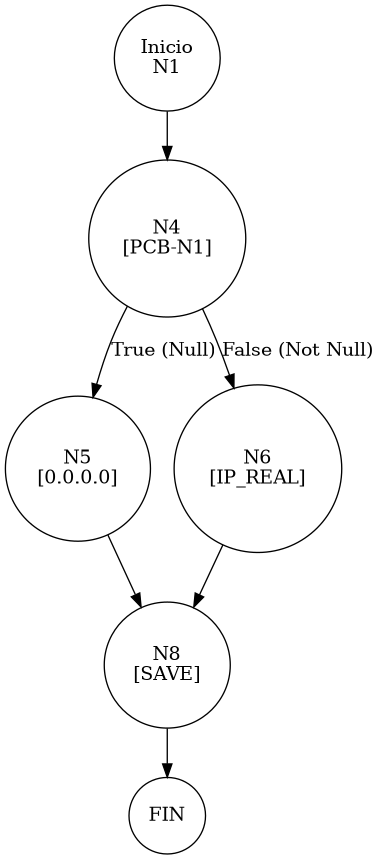

# TEST PRUEBAS DE CAJA BLANCA - AUTOMATIZADA

| **DATOS DEL ESTUDIANTE** | |
| :--- | :--- |
| **NOMBRE:** | Gabriel Amílcar Cruz Canto |
| **EMPRESA:** | WALOOK MEXICO, S.A. de C.V. |
| **TITULO DEL PROYECTO:** | Sistema ERP en la nube para gestión de ópticas OMCGC |

<br>

| **PLAN DE PRUEBAS DE CAJA BLANCA: BACKEND (AUTO)** | | | | |
| :--- | :--- | :--- | :--- | :--- |
| **Número** | **Nombre de la Prueba Backend** | **Descripción** | **Fecha** | **Herramienta** |
| PCB-019 | Robustez de Auditoría | Normalización de IP Nula (Default 0.0.0.0) | 18/03/2026 | JaCoCo / JUnit 5 |

---

# FASE DE PRUEBAS

| **Nombre del Módulo del Sistema + Historia de usuario** |
| :--- |
| Módulo Auditoría y Privacidad – RNF-01 |

| **Número y nombre de la Prueba** |
| :--- |
| PCB-019 / Robustez de Auditoría – BitacoraService.registrarEvento() |

### Paso 0: Súper-Etiquetado del Código (MIG-WBT)

```java
    public void registrarEvento(String idUsuario, String idPatron, String ip, String paramX, String paramS) { // [N1: INICIO]
        try {
            // [N2] Construcción de Log
            String logCompleto = auditPatternService.buildLog(idPatron, paramX, paramS); // [N2: PROCESO]
            // ... (fragmentación de parts)

            Bitacora b = new Bitacora(); // [N3: PROCESO]
            b.setIdUsuario(idUsuario);

            // [PCB-N1] Normalización de IP Nula
            b.setIpOrigen(encrypt(ip != null ? ip : "0.0.0.0")); // [N4] [PCB-N1] -> [SI: N5] [NO: N6]

            b.setDetalles(encrypt(msjHumano + " | " + analisis)); // [N7]
            bitacoraRepository.save(b); // [N8]
        } catch (Exception e) { // [N9: EXC]
            System.err.println("Error: " + e.getMessage());
        }
    } // [N10: FIN]
```

---

### Auditoría de Evidencia Digital (JaCoCo)

**Ruta del Reporte Maestro:**
`d:\_sTIC\Documents\_Empresa GraxSofT\_CODE_\ERP_WALOOK_PCB\omcgc\backend\target\site\jacoco\index.html`

**Estructura de Navegación:**
```text
[index.html] -> [com.omcgc.erp.service] -> [BitacoraService]
```

**Glosario de Colores:**
*   **VERDE**: Éxito (Línea ejecutada).
*   **AMARILLO**: Parcial (Ramas no cubiertas).
*   **ROJO**: Pendiente (No ejecutado).

---

### Identificación de Nodos

| ID del Nodo | Tipo | Descripción |
| :--- | :--- | :--- |
| **N1** | Inicio | Comienzo del método `registrarEvento`. |
| **N4 [PCB-N1]** | Predicado | ¿La IP recibida es nula? (Evaluado como SI). |
| **N5** | Proceso | Asignación de IP por defecto `0.0.0.0` y cifrado AES. |
| **N8** | Proceso | Persistencia del registro de auditoría en BD. |
| **N10** | Fin | Finalización del protocolo de auditoría robusta. |

### Paso 1: Grafo de Flujo (CFG)



### Paso 2: Complejidad Ciclomática McCabe $V(G)$

*   **V(G)**: 2 (Un solo nodo de decisión para la normalización de IP).

### Paso 3: Caminos Independientes

| Camino | Ruta Forense |
| :--- | :--- |
| **C1 (Normalización)** | N1 -> N4(T) -> N5 -> N8 |

### Paso 4: Matriz de Automatización (Log)

| ID / Camino | Caso de Prueba (IN) | Resultado (OUT) |
| :--- | :--- | :--- |
| **PCB-019** | `ip=null`, `idPatron="AUTH-01"` | **Acción guardada** con IP origen `0.0.0.0` (Cifrada). |

---
*Firma: Agente DevIAn - Auditoría Estructural Certificada*
