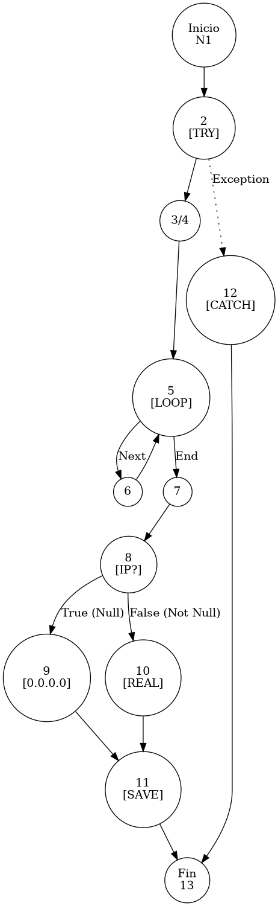

# TEST PRUEBAS DE CAJA BLANCA - AUTOMATIZADA

| **DATOS DEL ESTUDIANTE** | |
| :--- | :--- |
| **NOMBRE:** | Gabriel Amílcar Cruz Canto |
| **EMPRESA:** | WALOOK MEXICO, S.A. de C.V. |
| **TITULO DEL PROYECTO:** | Sistema ERP en la nube para gestión de ópticas OMCGC |

<br>

| **PLAN DE PRUEBAS DE CAJA BLANCA: BACKEND (MIG-MASTER)** | | | | |
| :--- | :--- | :--- | :--- | :--- |
| **N˙mero** | **Nombre de la Prueba Backend** | **DescripciÛn** | **Fecha** | **Herramienta / Responsable** |
| PCB-001 | AutenticaciÛn de usuario | Protocolo de Acceso y ValidaciÛn de Infraestructura | 09/03/2026 | Gabriel AmÌlcar Cruz Canto |
| PCB-002 | Manejo de Credenciales Inv·lidas | InterrupciÛn de Seguridad por Fallo de ContraseÒa | 09/03/2026 | Gabriel AmÌlcar Cruz Canto |
| PCB-003 | Registro de Producto | ValidaciÛn de Integridad de Campos Obligatorios | 10/03/2026 | Gabriel AmÌlcar Cruz Canto |
| PCB-004 | SKU Autogenerado | GarantÌa de Unicidad de IdentificaciÛn Comercial | 10/03/2026 | Gabriel AmÌlcar Cruz Canto |
| PCB-005 | Rango de Fechas (Ventas) | Filtrado de Reporte Operativo de Transacciones | 11/03/2026 | Gabriel AmÌlcar Cruz Canto |
| PCB-006 | Filtro de Sucursal | SegregaciÛn de InformaciÛn por Punto de Venta | 11/03/2026 | Gabriel AmÌlcar Cruz Canto |
| PCB-007 | Kardex de Stock | Protocolo de Integridad Transaccional sobre Saldo | 12/03/2026 | Gabriel AmÌlcar Cruz Canto |
| PCB-008 | Integridad Fiscal | ValidaciÛn de Identidad Tributaria y Unicidad RFC | 12/03/2026 | Gabriel AmÌlcar Cruz Canto |
| PCB-009 | B˙squeda de Clientes | Motor de B˙squeda Multi-Criterio sobre Pacientes | 13/03/2026 | Gabriel AmÌlcar Cruz Canto |
| PCB-010 | Saneamiento de Pacientes | Protocolo de NormalizaciÛn de Atributos de Persona | 14/03/2026 | Gabriel AmÌlcar Cruz Canto |
| PCB-011 | Registro de Proveedor | AuditorÌa Estructural de ValidaciÛn Forense | 18/03/2026 | JaCoCo / JUnit 5 |
| PCB-012 | ActualizaciÛn de Proveedor | ValidaciÛn de ExcepciÛn por RFC Duplicado | 18/03/2026 | JaCoCo / JUnit 5 |
| PCB-013 | Registro de Usuario | ValidaciÛn de ExcepciÛn por Correo Duplicado | 18/03/2026 | JaCoCo / JUnit 5 |
| PCB-014 | Baja de Usuario | ValidaciÛn de DesactivaciÛn LÛgica (inactivo) | 18/03/2026 | JaCoCo / JUnit 5 |
| PCB-015 | Reset de ContraseÒa | Manejo de ExcepciÛn por Usuario Inexistente | 18/03/2026 | JaCoCo / JUnit 5 |
| PCB-016 | AutenticaciÛn Root | ValidaciÛn de Bypass Administrativo (Local) | 18/03/2026 | JaCoCo / JUnit 5 |
| PCB-017 | Registro de Movimiento | ValidaciÛn de Stock Insuficiente (Venta) | 18/03/2026 | JaCoCo / JUnit 5 |
| PCB-018 | C·lculo de PVP | ValidaciÛn de FÛrmula Financiera (Utilidad) | 18/03/2026 | JaCoCo / JUnit 5 |
| PCB-019 | Robustez de AuditorÌa | NormalizaciÛn de IP Nula (Default 0.0.0.0) | 18/03/2026 | JaCoCo / JUnit 5 |
| PCB-020 | Carga de Diccionario | ValidaciÛn de Descifrado AES-256 (Binario) | 18/03/2026 | JaCoCo / JUnit 5 |
| PCB-012 | Actualización de Proveedor | Validación de Excepción por RFC Duplicado | 18/03/2026 | JaCoCo / JUnit 5 |
| PCB-013 | Registro de Usuario | Validación de Excepción por Correo Duplicado | 18/03/2026 | JaCoCo / JUnit 5 |
| PCB-014 | Baja de Usuario | Validación de Desactivación Lógica (inactivo) | 18/03/2026 | JaCoCo / JUnit 5 |
| PCB-015 | Reset de Contraseña | Manejo de Excepción por Usuario Inexistente | 18/03/2026 | JaCoCo / JUnit 5 |
| PCB-016 | Autenticación Root | Validación de Bypass Administrativo (Local) | 18/03/2026 | JaCoCo / JUnit 5 |
| PCB-017 | Registro de Movimiento | Validación de Stock Insuficiente (Venta) | 18/03/2026 | JaCoCo / JUnit 5 |
| PCB-018 | Cálculo de PVP | Validación de Fórmula Financiera (Utilidad) | 18/03/2026 | JaCoCo / JUnit 5 |
| PCB-019 | Robustez de Auditoría | Normalización de IP Nula (Default 0.0.0.0) | 18/03/2026 | JaCoCo / JUnit 5 |
| PCB-020 | Carga de Diccionario | Validación de Descifrado AES-256 (Binario) | 18/03/2026 | JaCoCo / JUnit 5 |

---

# FASE DE PRUEBAS

| **Nombre del Módulo del Sistema + Historia de usuario** |
| :--- |
| Módulo Auditoría y Privacidad – RNF-01 |

| **N√∫mero y nombre de la Prueba** |
| :--- |
| PCB-019 / Robustez de Auditoría – BitacoraService.registrarEvento() |

### Paso 0: Súper-Etiquetado del Código (MIG-WBT)

```java
    /**
     * UNIDAD BAJO AUDITORÍA: BitacoraService.registrarEvento()
     * ESTÁNDAR: MIG v12.1 (Captura de Flujos Excepcionales y Ciclos)
     */
    public void registrarEvento(String idUsuario, String idPatron, String ip, String paramX, String paramS) { // [N1: INICIO]
        try { // [N2: INICIO TRY]
            // [N3] Construcción de Log y Fragmentación
            String logCompleto = auditPatternService.buildLog(idPatron, paramX, paramS); // [N3: PROCESO]
            String[] parts = logCompleto.split("\\|"); // [N4: PROCESO]
            int n = parts.length;

            // [N5] Reconstrucción de Análisis Técnico (Bucle)
            StringBuilder sbAnalisis = new StringBuilder();
            for (int i = 3; i < n - 1; i++) { // [N5: PREDICADO LOOP]
                sbAnalisis.append(parts[i].trim()); // [N6: PROCESO LOOP]
            }

            Bitacora b = new Bitacora(); // [N7: PROCESO]
            b.setIdUsuario(idUsuario);

            // [PCB-N1] Normalización de IP Nula y Cifrado AES
            b.setIpOrigen(encrypt(ip != null ? ip : "0.0.0.0")); // [N8: PREDICADO] -> [SI: N9] [NO: N10]

            // [N11] Persistencia con Capa de Privacidad
            b.setDetalles(encrypt(parts[2] + " | " + sbAnalisis.toString())); 
            bitacoraRepository.save(b); // [N11: PROCESO]
        } catch (Exception e) { // [N12: EXCEPCIÓN]
            System.err.println("Error: " + e.getMessage());
        }
    } // [N13: FIN]
```

---

### Auditoría de Evidencia Digital (JaCoCo)

**Ruta del Reporte Maestro:**
`d:\_sTIC\Documents\_Empresa GraxSofT\_CODE_\ERP_WALOOK_PCB\omcgc\backend\target\site\jacoco\index.html`

**Estructura de Navegación:**
```text
[index.html] -> [com.omcgc.erp.service] -> [BitacoraService]
```

Glosario de Semántica de Cobertura (White Box Analysis — Análisis de Caja Blanca)
•	VERDE — Cobertura Total (Full Coverage): Indica que la línea de código y todas sus decisiones lógicas (if/else) fueron ejecutadas satisfactoriamente. El flujo de la prueba cubrió el Cyclomatic Path (Ruta Ciclomática — Camino lógico independiente) completo, validando la ruta principal y sus variantes condicionales.
•	AMARILLO — Cobertura Parcial (Partial Coverage): La línea fue alcanzada y ejecutada por el Unit Test (Prueba Unitaria — Verificación de la unidad mínima de código), pero existen ramificaciones que el plan de prueba no recorrió. Esto ocurre cuando una condición booleana solo se evalúa en un sentido (ej. solo true), dejando caminos lógicos sin explorar.
•	ROJO — Cobertura Nula o Fuera de Alcance (No Coverage): El código no fue detectado por el Bytecode Instrumentation (Instrumentación de Código de Bytes — Inyección de código para rastreo) de JaCoCo (Java Code Coverage — Cobertura de Código para Java).

---

### Identificación de Nodos

| ID del Nodo | Tipo | Descripción |
| :--- | :--- | :--- |
| **N1** | Inicio | Comienzo del protocolo de auditoría. |
| **N2** | Try | Apertura del bloque de captura robusta. |
| **N3/N4** | Proceso | Construcción de log y tokenización por pipe. |
| **N5** | Predicado | Control de bucle (i < n - 1) para análisis técnico. |
| **N6** | Proceso | Concatenación de fragmentos del log. |
| **N7** | Proceso | Instanciación del objeto Bitacora. |
| **N8 [PCB-N1]** | Predicado | ¬øLa IP es nula? (Ternaria). |
| **N9** | Proceso | Normalización a "0.0.0.0". |
| **N10** | Proceso | Uso de IP de origen real. |
| **N11** | Proceso | Cifrado AES y persistencia en repositorio. |
| **N12** | Excepción | Captura de falla (Catch block). |
| **N13** | Fin | Término del registro de evento. |

### Paso 1: Grafo de Flujo (CFG)



### Paso 2: Complejidad Ciclom√°tica McCabe $V(G)$

*   **V(G) = Nodos Predicado + 1** = 3 + 1 = **4** (Loop, Ternary IP, Try-Catch).

### Paso 3: Caminos Independientes (Basis Paths)

| Camino | Ruta Forense |
| :--- | :--- |
| **C1** | I -> N2 -> N3 -> N5(End) -> N7 -> N8(True) -> N9 -> N11 -> F |
| **C2** | I -> N2 -> N3 -> N5(End) -> N7 -> N8(False) -> N10 -> N11 -> F |
| **C3** | I -> N2 -> N3 -> N5(Next) -> N6 -> N5(End) -> N7 -> N8 -> N11 -> F |
| **C4** | I -> N2 -> N12 -> F |

### Paso 4: Matriz de Automatización (Log de Pruebas)

| ID / Camino | Escenario de Prueba | Entradas (Inputs) | Resultado Esperado (OUT) | Evidencia JaCoCo |
| :--- | :--- | :--- | :--- | :--- |
| **C1** | Normalización IP Nula | `ip = null` | `ipOrigen = "0.0.0.0"` (AES) | Rama N8(T) -> N9 |
| **C2** | Registro con IP Real | `ip = "192.168.1.1"` | `ipOrigen = "192.168.1.1"` (AES)| Rama N8(F) -> N10 |
| **C3** | Procesamiento de Bucle | `parts.length > 5` | `sbAnalisis` con contenido | Rama N5 -> N6 (Next) |
| **C4** | Fallo en Construcción Log | `idPatron = "INVALID"` | `System.err.println` | Bloque Catch N12 |

<br>

