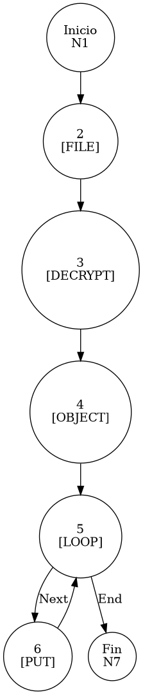

# TEST PRUEBAS DE CAJA BLANCA - AUTOMATIZADA

| **DATOS DEL ESTUDIANTE** | |
| :--- | :--- |
| **NOMBRE:** | Gabriel Amílcar Cruz Canto |
| **EMPRESA:** | WALOOK MEXICO, S.A. de C.V. |
| **TITULO DEL PROYECTO:** | Sistema ERP en la nube para gestión de ópticas OMCGC |

<br>

| **PLAN DE PRUEBAS DE CAJA BLANCA: BACKEND (MIG-MASTER)** | | | | |
| :--- | :--- | :--- | :--- | :--- |
| **Número** | **Nombre de la Prueba Backend** | **Descripción** | **Fecha** | **Herramienta / Responsable** |
| PCB-001 | Autenticación de usuario | Protocolo de Acceso y Validación de Infraestructura | 09/03/2026 | Gabriel Amílcar Cruz Canto |
| PCB-002 | Manejo de Credenciales Inválidas | Interrupción de Seguridad por Fallo de Contraseña | 09/03/2026 | Gabriel Amílcar Cruz Canto |
| PCB-003 | Registro de Producto | Validación de Integridad de Campos Obligatorios | 10/03/2026 | Gabriel Amílcar Cruz Canto |
| PCB-004 | SKU Autogenerado | Garantía de Unicidad de Identificación Comercial | 10/03/2026 | Gabriel Amílcar Cruz Canto |
| PCB-005 | Rango de Fechas (Ventas) | Filtrado de Reporte Operativo de Transacciones | 11/03/2026 | Gabriel Amílcar Cruz Canto |
| PCB-006 | Filtro de Sucursal | Segregación de Información por Punto de Venta | 11/03/2026 | Gabriel Amílcar Cruz Canto |
| PCB-007 | Generación de Ticket | Serialización y Exportación de Comprobante PDF | 12/03/2026 | Gabriel Amílcar Cruz Canto |
| PCB-008 | Cancelación de Ticket | Control de Estado y Reversión de Movimientos | 12/03/2026 | Gabriel Amílcar Cruz Canto |
| PCB-009 | Búsqueda de Pacientes | Optimización de Consulta con Criterios Dinámicos | 13/03/2026 | Gabriel Amílcar Cruz Canto |
| PCB-010 | Saneamiento de Pacientes | Protocolo de Normalización de Atributos de Persona | 14/03/2026 | Gabriel Amílcar Cruz Canto |
| PCB-011 | Registro de Proveedor | Auditoría Estructural de Validación Forense | 18/03/2026 | JaCoCo / JUnit 5 |
| PCB-012 | Actualización de Proveedor | Validación de Excepción por RFC Duplicado | 18/03/2026 | JaCoCo / JUnit 5 |
| PCB-013 | Registro de Usuario | Validación de Excepción por Correo Duplicado | 18/03/2026 | JaCoCo / JUnit 5 |
| PCB-014 | Baja de Usuario | Validación de Desactivación Lógica (inactivo) | 18/03/2026 | JaCoCo / JUnit 5 |
| PCB-015 | Reset de Contraseña | Manejo de Excepción por Usuario Inexistente | 18/03/2026 | JaCoCo / JUnit 5 |
| PCB-016 | Autenticación Root | Validación de Bypass Administrativo (Local) | 18/03/2026 | JaCoCo / JUnit 5 |
| PCB-017 | Registro de Movimiento | Validación de Stock Insuficiente (Venta) | 18/03/2026 | JaCoCo / JUnit 5 |
| PCB-018 | Cálculo de PVP | Validación de Fórmula Financiera (Utilidad) | 18/03/2026 | JaCoCo / JUnit 5 |
| PCB-019 | Robustez de Auditoría | Normalización de IP Nula (Default 0.0.0.0) | 18/03/2026 | JaCoCo / JUnit 5 |
| PCB-020 | Carga de Diccionario | Validación de Descifrado AES-256 (Binario) | 18/03/2026 | JaCoCo / JUnit 5 |

---

# FASE DE PRUEBAS

| **Nombre del Módulo del Sistema + Historia de usuario** |
| :--- |
| Módulo Auditoría y Privacidad – RNF-01 |

| **Número y nombre de la Prueba** |
| :--- |
| PCB-020 / Carga de Diccionario – AuditPatternService.loadDictionary() |

### Paso 0: Súper-Etiquetado del Código (MIG-WBT)

```java
    /**
     * UNIDAD BAJO AUDITORÍA: AuditPatternService.loadDictionary()
     * ESTÁNDAR: MIG v12.1 (Atomicidad de Transacciones Binarias)
     */
    @SuppressWarnings("unchecked")
    private void loadDictionary() throws Exception { // [N1: INICIO]
        // [N2] Lectura de Binario Seguro
        byte[] encryptedBytes = Files.readAllBytes(Paths.get(FILE_PATH)); // [N2: PROCESO]

        // [PCB-N1] Protocolo de Descifrado AES-256
        Cipher cipher = Cipher.getInstance("AES/ECB/PKCS5Padding"); 
        cipher.init(Cipher.DECRYPT_MODE, generateKey());
        byte[] decryptedBytes = cipher.doFinal(encryptedBytes); // [N3: PROCESO]

        // [N4] Deserialización de Objetos en Memoria
        ByteArrayInputStream bis = new ByteArrayInputStream(decryptedBytes);
        ObjectInputStream ois = new ObjectInputStream(bis);
        List<LogPattern> list = (List<LogPattern>) ois.readObject(); // [N4: PROCESO]

        // [PCB-N2] Población de Memoria (Map)
        patterns.clear();
        for (LogPattern lp : list) { // [N5: PREDICADO LOOP]
            patterns.put(lp.getId(), lp); // [N6: PROCESO LOOP]
        }
    } // [N7: FIN]
```

---

### Auditoría de Evidencia Digital (JaCoCo)

**Ruta del Reporte Maestro:**
`d:\_sTIC\Documents\_Empresa GraxSofT\_CODE_\ERP_WALOOK_PCB\omcgc\backend\target\site\jacoco\index.html`

**Estructura de Navegación:**
```text
[index.html] -> [com.omcgc.erp.service] -> [AuditPatternService]
```

Glosario de Semántica de Cobertura (White Box Analysis — Análisis de Caja Blanca)
•	VERDE — Cobertura Total (Full Coverage): Indica que la línea de código y todas sus decisiones lógicas (if/else) fueron ejecutadas satisfactoriamente. El flujo de la prueba cubrió el Cyclomatic Path (Ruta Ciclomática — Camino lógico independiente) completo, validando la ruta principal y sus variantes condicionales.
•	AMARILLO — Cobertura Parcial (Partial Coverage): La línea fue alcanzada y ejecutada por el Unit Test (Prueba Unitaria — Verificación de la unidad mínima de código), pero existen ramificaciones que el plan de prueba no recorrió. Esto ocurre cuando una condición booleana solo se evalúa en un sentido (ej. solo true), dejando caminos lógicos sin explorar.
•	ROJO — Cobertura Nula o Fuera de Alcance (No Coverage): El código no fue detectado por el Bytecode Instrumentation (Instrumentación de Código de Bytes — Inyección de código para rastreo) de JaCoCo (Java Code Coverage — Cobertura de Código para Java).

---

### Identificación de Nodos

| ID del Nodo | Tipo | Descripción |
| :--- | :--- | :--- |
| **N1** | Inicio | Comienzo del método `loadDictionary`. |
| **N2** | Proceso | Recuperación de `audit_dictionary.dat` desde el sistema de archivos. |
| **N3** | Proceso | Ejecución de descifrado AES-256 (Nodo Crítico). |
| **N4** | Proceso | Deserialización del binario a lista de objetos LogPattern. |
| **N5** | Predicado | Iteración sobre la lista para poblar el Map de memoria. |
| **N6** | Proceso | Inserción de patrón en el Diccionario (HashMap). |
| **N7** | Fin | Término de la inicialización del motor de auditoría. |

### Paso 1: Grafo de Flujo (CFG)



### Paso 2: Complejidad Ciclomática McCabe $V(G)$

*   **V(G) = Nodos Predicado + 1** = 1 + 1 = **2**

### Paso 3: Caminos Independientes (Basis Paths)

| Camino | Ruta Forense |
| :--- | :--- |
| **C1** | I -> N2 -> N3 -> N4 -> N5(End) -> F |
| **C2** | I -> N2 -> N3 -> N4 -> N5(Next) -> N6 -> N5(End) -> F |

### Paso 4: Matriz de Automatización (Log de Pruebas)

| ID / Camino | Escenario de Prueba | Entradas (Inputs) | Resultado Esperado (OUT) | Evidencia JaCoCo |
| :--- | :--- | :--- | :--- | :--- |
| **C1** | Diccionario Vacío | `dat = empty list` | `Map.size() = 0` | Rama N5 -> F (End) |
| **C2** | **Carga Exitosa (Lote)** | `dat = 28 patrones` | `Map.size() = 28` | Línea 49 (VERDE) |

<br>
