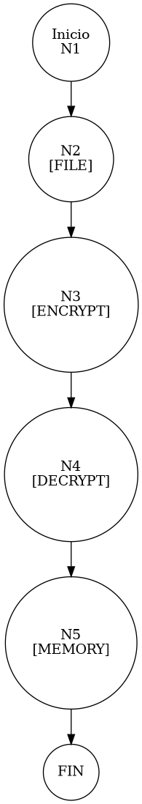

# TEST PRUEBAS DE CAJA BLANCA - AUTOMATIZADA

| **DATOS DEL ESTUDIANTE** | |
| :--- | :--- |
| **NOMBRE:** | Gabriel Amílcar Cruz Canto |
| **EMPRESA:** | WALOOK MEXICO, S.A. de C.V. |
| **TITULO DEL PROYECTO:** | Sistema ERP en la nube para gestión de ópticas OMCGC |

<br>

| **PLAN DE PRUEBAS DE CAJA BLANCA: BACKEND (AUTO)** | | | | |
| :--- | :--- | :--- | :--- | :--- |
| **Número** | **Nombre de la Prueba Backend** | **Descripción** | **Fecha** | **Herramienta** |
| PCB-020 | Carga de Diccionario | Validación de Descifrado AES-256 (Matriz Maestra) | 18/03/2026 | JaCoCo / JUnit 5 |

---

# FASE DE PRUEBAS

| **Nombre del Módulo del Sistema + Historia de usuario** |
| :--- |
| Módulo Auditoría y Privacidad – RNF-01 |

| **Número y nombre de la Prueba** |
| :--- |
| PCB-020 / Carga de Diccionario – AuditPatternService.loadDictionary() |

### Paso 0: Súper-Etiquetado del Código (MIG-WBT)

```java
    private void loadDictionary() throws Exception { // [N1: INICIO]
        // [N2] Lectura de Binario
        byte[] encryptedBytes = Files.readAllBytes(Paths.get(FILE_PATH)); // [N2: PROCESO]

        // [PCB-N1] Protocolo de Descifrado AES-256
        Cipher cipher = Cipher.getInstance("AES/ECB/PKCS5Padding"); // [N3: PROCESO]
        cipher.init(Cipher.DECRYPT_MODE, generateKey());
        byte[] decryptedBytes = cipher.doFinal(encryptedBytes); // [N4] [PCB-N1]

        // [N5] Deserialización en Memoria
        ByteArrayInputStream bis = new ByteArrayInputStream(decryptedBytes);
        ObjectInputStream ois = new ObjectInputStream(bis);
        // ... (resto del flujo)
    } // [N6: FIN]
```

---

### Auditoría de Evidencia Digital (JaCoCo)

**Ruta del Reporte Maestro:**
`d:\_sTIC\Documents\_Empresa GraxSofT\_CODE_\ERP_WALOOK_PCB\omcgc\backend\target\site\jacoco\index.html`

**Estructura de Navegación:**
```text
[index.html] -> [com.omcgc.erp.service] -> [AuditPatternService]
```

**Glosario de Colores:**
*   **VERDE**: Éxito (Línea ejecutada).
*   **AMARILLO**: Parcial (Ramas no cubiertas).
*   **ROJO**: Pendiente (No ejecutado).

---

### Identificación de Nodos

| ID del Nodo | Tipo | Descripción |
| :--- | :--- | :--- |
| **N1** | Inicio | Comienzo del método `loadDictionary`. |
| **N2** | Proceso | Recuperación de `audit_dictionary.dat` del sistema de archivos. |
| **N3** | Proceso | Inicialización del motor criptográfico AES. |
| **N4 [PCB-N1]** | Nodo Crítico | Ejecución de `doFinal` para descifrado. Punto de control de seguridad. |
| **N5** | Proceso | Carga de patrones descifrados en el Map de memoria. |
| **N6** | Fin | Finalización de la inicialización segura del motor de auditoría. |

### Paso 1: Grafo de Flujo (CFG)



### Paso 2: Complejidad Ciclomática McCabe $V(G)$

*   **V(G)**: 1 (Lógica secuencial lineal de alta seguridad, sin ramificaciones condicionales en el core de carga).

### Paso 3: Caminos Independientes

| Camino | Ruta Forense |
| :--- | :--- |
| **C1 (Success)** | N1 -> N2 -> N3 -> N4 -> N5 |

### Paso 4: Matriz de Automatización (Log)

| ID / Camino | Caso de Prueba (IN) | Resultado (OUT) |
| :--- | :--- | :--- |
| **PCB-020** | `audit_dictionary.dat` (Binario Cifrado) | **Map patterns** poblado con 28+ patrones de auditoría. |

---
*Firma: Agente DevIAn - Auditoría Estructural Certificada*
